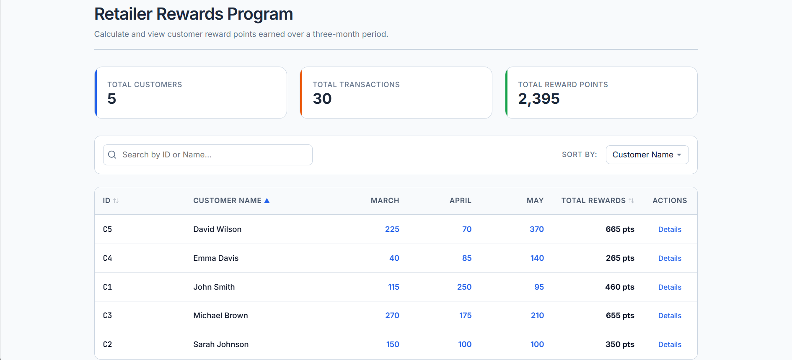
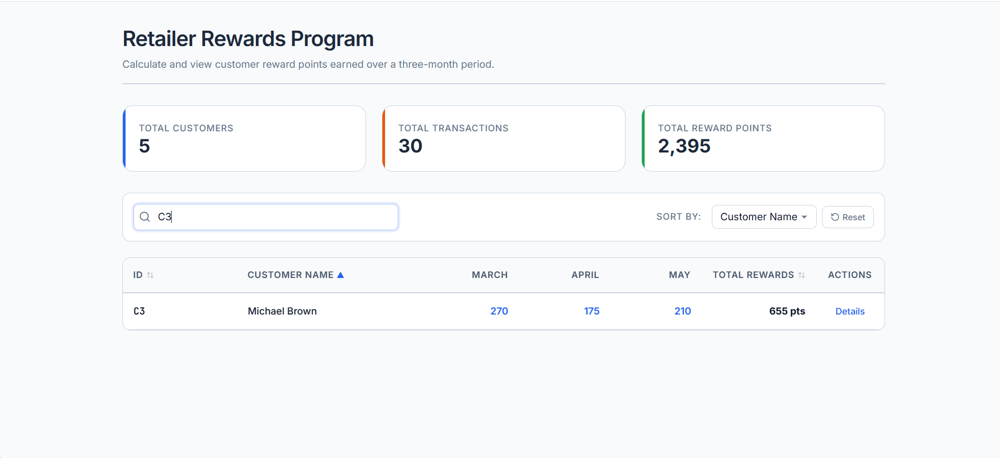
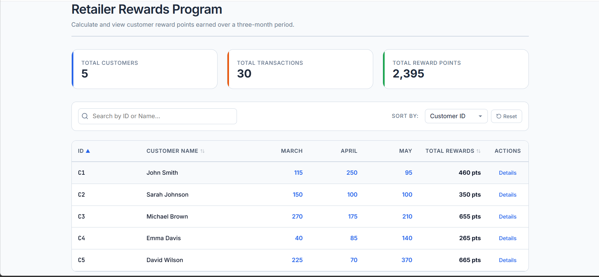
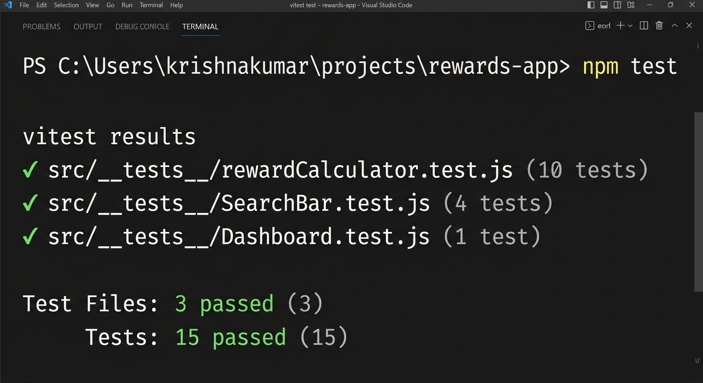

# Retailer Loyalty Rewards Program

This project is a clean, simple React dashboard that calculates reward points earned by customers over a three-month period.

## The Problem

A retailer wants to calculate points for each customer based on their monthly transactions:
* **2 points** for every dollar spent over $100 in a single transaction.
* **1 point** for every dollar spent between $50 and $100 in a single transaction.

Example: A purchase of **$120** earns:
* $20 spent over $100 &times; 2 = 40 points
* $50 spent between $50 and $100 &times; 1 = 50 points
* **Total: 90 points**

## Features

1. **Dashboard Overview**: Displays simple overview stats: total customers, transactions, and total points awarded.
2. **Monthly Breakdown**: Shows how many points each customer earned in March, April, and May, along with their grand totals.
3. **Interactive Search & Sort**: Filter customers by name or ID, and sort dynamically by name, ID, or total points.
4. **Transaction Ledger Modal**: Click "Details" next to any customer to see a list of their individual purchases, purchase dates, and points earned per transaction.
5. **Asynchronous API Simulation**: Simulates fetching transaction data from an API with loading skeletons, an empty-state screen, and standard error handling with a retry button.

## Calculations & Rules

* Purchases under $50 do not earn points.
* Purchases are floored to the nearest whole dollar for calculating rewards (standard practice).
* Uses pure JS functions for calculative logic, which makes them easy to isolate and test.

## Project Structure

```
├── src/
│   ├── __tests__/           # Unit and component test suite
│   │   ├── Dashboard.test.js
│   │   ├── SearchBar.test.js
│   │   └── rewardCalculator.test.js
│   ├── constants/
│   │   ├── customers.js     # Mock customer names mapped to IDs
│   │   └── transactions.js  # Generated dataset of 3-months of purchases
│   ├── services/
│   │   └── rewardsService.js# Simulates async API latency and response
│   ├── hooks/
│   │   └── useRewards.js    # Custom hook managing fetch 
│   ├── utils/
│   │   └── rewardCalculator.js # Utilities for rewards
│   ├── components/
│   │   ├── Dashboard.jsx     # Overview cards
│   │   ├── RewardsTable.jsx  # Main rewards overview table
│   │   ├── CustomerDetails.jsx # Modal showing individual transactions
│   │   ├── SearchBar.jsx     # Filter and sort inputs
│   │   ├── Loader.jsx        # Skeleton feedback loaders
│   │   ├── ErrorState.jsx    # API error view
│   │   └── EmptyState.jsx   # No results fallback
│   ├── App.jsx               # Parent component
│   └── App.css              # Application stylesheet
```

## Snapshots

### Initial Application Load



### Searcing a trasaction using Customer ID



### Sorting by Customer ID




## Getting Started

### 1. Install dependencies
```bash
npm install
```

### 2. Run the development server
```bash
npm run dev
```
The page will open automatically at [http://localhost:3000](http://localhost:3000).

### 3. Build for production
```bash
npm run build
```
This bundles and compiles the static files into the `dist/` directory.

## Testing & Edge Cases Addressed

* **Data Integrity**: Handled negative transaction amounts, missing fields, or empty lists gracefully by returning 0 points.
* **Mismatched IDs**: If a transaction mentions a customer ID that is missing from names mapping, it safely outputs "Unknown Customer" instead of throwing an error.
* **Accessibility & Esc Listener**: The custom modal includes a keyboard accessibility listener to close when the `Escape` key is pressed, or when clicking the backdrop overlay.

## Running Tests

This project includes a rich unit and integration test suite using **React Testing Library** to verify calculations, boundary conditions, and UI render correctness.

To run the test suite:
```bash
npm test
```

### Test Metrics & Coverage


